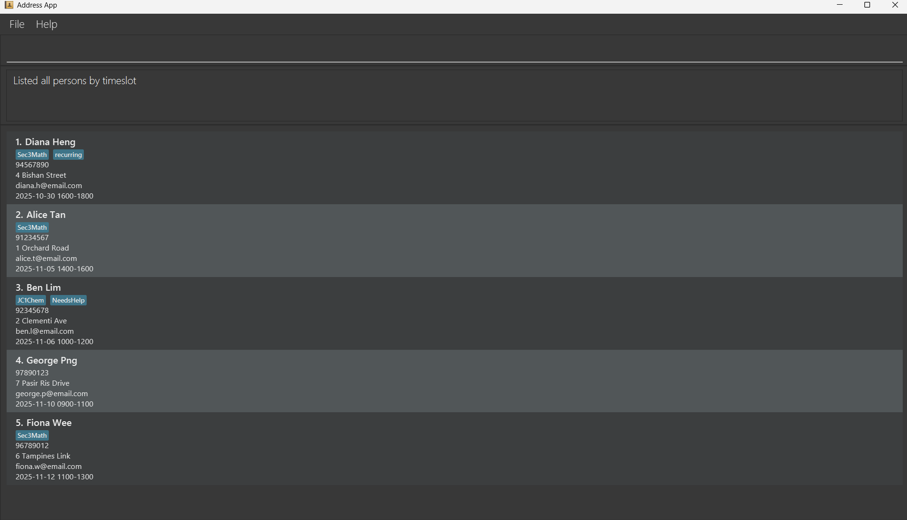
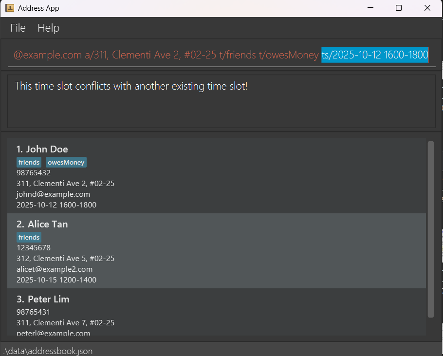

# AB-3 User Guide

AddressBook Level 3 (AB3) is a **desktop app for managing contacts, optimized for use via a Command Line Interface** (CLI) while still having the benefits of a Graphical User Interface (GUI). If you can type fast, AB3 can get your contact management tasks done faster than traditional GUI apps.

<page-nav-print />

--------------------------------------------------------------------------------------------------------------------

## Quick start

1.  Ensure you have Java `17` or above installed in your Computer. 
    **Mac users:** Ensure you have the precise JDK version prescribed [here](https://se-education.org/guides/tutorials/javaInstallationMac.html).

2.  Download the latest `.jar` file from [here](https://github.com/AY2526S1-CS2103T-T15-1/tp/releases/tag/v1.4).

3.  Copy the file to the folder you want to use as the _home folder_ for your AddressBook.

4.  Open a command terminal, `cd` into the folder you put the jar file in, and use the `java -jar addressbook.jar` command to run the application. 
    A GUI similar to the below should appear in a few seconds. Note how the app contains some sample data. 
    

5.  Type the command in the command box and press Enter to execute it. e.g. typing **`help`** and pressing Enter will open the help window. 
    Some example commands you can try:

    * `list` : Lists all contacts which are sorted by time slot.

    * `add n/John Doe p/98765432 e/johnd@example.com a/John street, block 123, #01-01 t/Chemistry ts/2025-10-20 1400-1500` : Adds a contact named `John Doe` with a specified tag and time slot to the Address Book.

    * `delete 3` : Deletes the 3rd contact shown in the current list.

    * `clear` : Deletes all contacts.

    * `help` : Displays a message explaining how to access the help page

    * `exit` : Exits the app.

6.  Refer to the [Features](#features) below for details of each command.

--------------------------------------------------------------------------------------------------------------------

## Features

<box type="info" seamless>

**Notes about the command format:** 

* Words in `UPPER_CASE` are the parameters to be supplied by the user. 
  e.g. in `add n/NAME`, `NAME` is a parameter which can be used as `add n/John Doe`.

* Items in square brackets `[]` are optional. 
  e.g. `n/NAME [t/TAG]` can be used as `n/John Doe t/friend` or as `n/John Doe`.

* Items with `…`​ after them can be used multiple times including zero times. 
  e.g. `[t/TAG]…​` can be used as ` ` (i.e. 0 times), `t/friend`, `t/friend t/family` etc.

* Parameters can be in any order. 
  e.g. if the command specifies `n/NAME p/PHONE_NUMBER`, `p/PHONE_NUMBER n/NAME` is also acceptable.

* Extraneous parameters for commands that do not take in parameters (such as `help`, `list`, `exit` and `clear`) will be ignored. 
  e.g. if the command specifies `help 123`, it will be interpreted as `help`.

* If you are using a PDF version of this document, be careful when copying and pasting commands that span multiple lines as space characters surrounding line-breaks may be omitted when copied over to the application.
  </box>

### Viewing help : `help`

Shows a message explaining how to access the help page.

Format: `help`

### Adding a person: `add`

Adds a person to the address book.

Format: `add n/NAME p/PHONE_NUMBER e/EMAIL a/ADDRESS ts/YYYY-MM-DD HHMM-HHMM [t/TAG]…​`

* The `ts/` (time slot) parameter is mandatory for all new contacts.
* The application automatically checks for scheduling conflicts and prevents you from adding a contact whose time slot overlaps with an existing one.

<box type="tip" seamless>

**Note:** A person can have any number of tags (including 0)
</box>

Examples:
* `add n/John Doe p/98765432 e/johnd@example.com a/John street, block 123, #01-01 ts/2025-10-27 1000-1100`
* `add n/Betsy Crowe t/friend e/betsycrowe@example.com a/Newgate Prison p/1234567 t/criminal ts/2025-10-27 1100-1200`

Example of timeslot-conflict:

### Listing all persons : `list`

Shows a list of all persons in the address book, **sorted by their time slot**.

Format: `list`

### Editing a person : `edit`

Edits an existing person in the address book.

Format: `edit INDEX [n/NAME] [p/PHONE] [e/EMAIL] [a/ADDRESS] [ts/TIMESLOT] [t/TAG]…​`

* Edits the person at the specified `INDEX`. The index refers to the index number shown in the displayed person list. The index **must be a positive integer** 1, 2, 3, …​
* At least one of the optional fields must be provided.
* Existing values will be updated to the input values.
* If you edit the time slot (`ts/`), the application will check for scheduling conflicts.
* When editing tags, the existing tags of the person will be removed i.e. adding of tags is not cumulative.
* You can remove all the person’s tags by typing `t/` without
  specifying any tags after it.

Examples:
* `edit 1 p/91234567 e/johndoe@example.com` Edits the phone number and email address of the 1st person to be `91234567` and `johndoe@example.com` respectively.
* `edit 2 n/Betsy Crower t/` Edits the name of the 2nd person to be `Betsy Crower` and clears all the person's existing tags.
* `edit 1 ts/2025-11-20 1500-1600` Edits the time slot of the 1st person.

### Locating persons by name: `find`

Finds persons whose names contain any of the given keywords.

Format: `find KEYWORD [MORE_KEYWORDS]`

* The search is case-insensitive. e.g. `hans` will match `Hans`
* The search is a substring match search. e.g. `Ha` will match `Hans` and `ming han`.
* The order of the keywords does not matter. e.g. `Hans Bo` will match `Bo Hans`
* Only the name is searched.
* Persons matching at least one keyword will be returned (i.e. `OR` search).
  e.g. `Hans Bo` will return `Hans Gruber`, `Bo Yang`

Examples:
* `find John` returns `John` and `John Doe`
* `find alex david` returns `Alex Yeoh`, `David Li` 
  

### Locating persons by tag: `findtag`

Finds contacts that match at least one of the given tags.

Format: `findtag TAG [MORE_TAGS]…`

* The search is case-insensitive.
* Persons matching at least one tag will be returned (i.e. `OR` search).

Examples:
* `findtag Math` will return contacts with tag `Math`
* `findtag Math English` will return contacts with tag `Math` or tag `English`

### Finding persons by time slot : `findtimeslot`

Finds contacts based on their scheduled time slots. This command supports three types of searches: by date, by time, or by both.

Format: `findtimeslot [YYYY-MM-DD] [HHMM]`

* At least one parameter (date or time) must be provided.
* **Find by Date:** Lists all persons with a time slot on that specific date.
* **Find by Time:** Lists all persons whose time slot starts at that specific time, regardless of date.
* **Find by Date and Time:** Lists all persons with a time slot on that specific date *and* starting at that specific time.

Examples:
* `findtimeslot 2025-10-12` (Finds all contacts on 2025-10-12)

* `findtimeslot 1200` (Finds all contacts with appointments starting at 12:00)
* `findtimeslot 2025-10-12 1200` (Finds all contacts on 2025-10-12 starting at 12:00)
  

### Filtering persons by time slot range : `filtertimeslot`

Filters the contact list to show only persons with time slots that fall within a specified date and/or time range.

Format: `filtertimeslot [sd/START_DATE] [ed/END_DATE] [st/START_TIME] [et/END_TIME]`

* You must provide at least one of the following prefixes:
    * `sd/` (start date, e.g., `2025-10-27`)
    * `ed/` (end date, e.g., `2025-10-28`)
    * `st/` (start time, e.g., `0800`)
    * `et/` (end time, e.g., `1200`)
* All fields are optional, but at least one must be present.
* If `sd/` is provided without `ed/`, it filters for all time slots on or after the start date.
* If `ed/` is provided without `sd/`, it filters for all time slots on or before the end date.
* If `st/` is provided without `et/`, it filters for all time slots on or after the start time.
* If `et/` is provided without `st/`, it filters for all time slots on or before the end time.

Examples:
* `filtertimeslot sd/2025-10-27 ed/2025-10-27 st/0800 et/1200`

  Result: Only contacts with time slots on 27 Oct 2025, between 08:00 and 12:00, are shown.

  
* `filtertimeslot sd/2025-10-27 st/0800 et/1200`
  Result: Only contacts with time slots on or after 27 Oct 2025, between 08:00 and 12:00, are shown.
* `filtertimeslot sd/2025-10-20 ed/2025-10-21 st/0800`

  Result: Only contacts with time slots between 20-21 Oct 2025, starting on or after 08:00, are shown.

### Deleting a person : `delete`

Deletes the specified person from the address book.

Format: `delete INDEX`

* Deletes the person at the specified `INDEX`.
* The index refers to the index number shown in the displayed person list.
* The index **must be a positive integer** 1, 2, 3, …​

Examples:
* `list` followed by `delete 2` deletes the 2nd person in the address book.
* `find Betsy` followed by `delete 1` deletes the 1st person in the results of the `find` command.

### Clearing past appointments : `clearpast`

Clears contacts with time slots that are in the past.

Format: `clearpast`

* This command uses the current system time to determine which time slots are in the past.
* Contacts tagged as `recurring` will **not** be deleted.
* Instead, for `recurring` contacts, the time slot is automatically updated in 7-day intervals until the new slot falls in the future relative to the system time.
* The update will fail with an error message if the new recurring time slot conflicts with an existing appointment.

Sample message shown to user in dialog box:

### Clearing all entries : `clear`

Clears all entries from the address book.

Format: `clear`

### Exiting the program : `exit`

Exits the program.

Format: `exit`

### Saving the data

AddressBook data are saved in the hard disk automatically after any command that changes the data. There is no need to save manually.

### Editing the data file

AddressBook data are saved automatically as a JSON file `[JAR file location]/data/addressbook.json`. Advanced users are welcome to update data directly by editing that data file.

<box type="warning" seamless>

**Caution:**
If your changes to the data file makes its format invalid, AddressBook will discard all data and start with an empty data file at the next run. Hence, it is recommended to take a backup of the file before editing it. 
Furthermore, certain edits can cause the AddressBook to behave in unexpected ways (e.g., if a value entered is outside the acceptable range). Therefore, edit the data file only if you are confident that you can update it correctly.
</box>

### Archiving data files `[coming in v2.0]`

_Details coming soon ..._

--------------------------------------------------------------------------------------------------------------------

## FAQ

**Q**: How do I transfer my data to another Computer? 
**A**: Install the app in the other computer and overwrite the empty data file it creates with the file that contains the data of your previous AddressBook home folder.

--------------------------------------------------------------------------------------------------------------------

## Known issues

1.  **When using multiple screens**, if you move the application to a secondary screen, and later switch to using only the primary screen, the GUI will open off-screen. The remedy is to delete the `preferences.json` file created by the application before running the application again.
2.  **If you minimize the Help Window** and then run the `help` command (or use the `Help` menu, or the keyboard shortcut `F1`) again, the original Help Window will remain minimized, and no new Help Window will appear. The remedy is to manually restore the minimized Help Window.

--------------------------------------------------------------------------------------------------------------------

## Command summary

Action | Format, Examples
-----------|----------------------------------------------------------------------------------------------------------------------------------------------------------------------
**Add** | `add n/NAME p/PHONE_NUMBER e/EMAIL a/ADDRESS ts/YYYY-MM-DD HHMM-HHMM [t/TAG]…​`   e.g., `add n/James Ho p/22224444 e/jamesho@example.com a/123, Clementi Rd, 1234665 ts/2025-10-27 1400-1600 t/friend t/colleague`
**Clear** | `clear`
**Delete** | `delete INDEX`  e.g., `delete 3`
**Edit** | `edit INDEX [n/NAME] [p/PHONE_NUMBER] [e/EMAIL] [a/ADDRESS] [ts/TIMESLOT] [t/TAG]…​`  e.g.,`edit 2 n/James Lee e/jameslee@example.com`
**Find** | `find KEYWORD [MORE_KEYWORDS]…`  e.g., `find James Jake`
**List** | `list`
**Help** | `help`
**Findtag**| `findtag TAG [MORE_TAGS]…`   e.g., `findtag Math English`
**FindTimeSlot** | `findtimeslot [YYYY-MM-DD] [HHMM]`   e.g. `findtimeslot 2025-10-27 1400`
**Filtertimeslot** | `filtertimeslot [sd/START_DATE] [ed/END_DATE] [st/START_TIME] [et/END_TIME]`   e.g `filtertimeslot sd/2025-10-27 ed/2025-10-27 st/0800 et/1200`
**Clearpast** | `clearpast`
