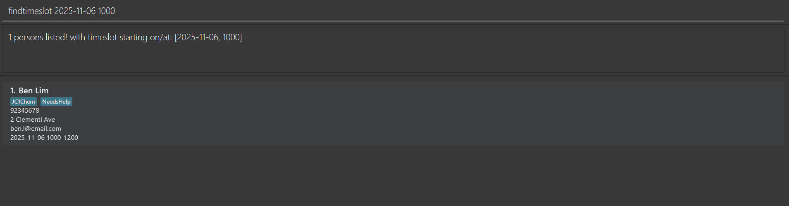

# EduTrack User Guide

EduTrack is a **desktop app for private tutors to manage their students, optimized for use via a Command Line Interface** (CLI) while still having the benefits of a Graphical User Interface (GUI). If you can type fast, EduTrack can help you with student scheduling (among other management tasks) faster than traditional GUI apps, allowing you to focus on tecahing rather than mundane admin work.

<page-nav-print />

--------------------------------------------------------------------------------------------------------------------

## Quick start

1.  Ensure you have Java `17` or above installed in your Computer. 
    **Mac users:** Ensure you have the precise JDK version prescribed [here](https://se-education.org/guides/tutorials/javaInstallationMac.html).

2.  Download the latest `.jar` file from [here](https://github.com/AY2526S1-CS2103T-T15-1/tp/releases/tag/v1.4).

3.  Copy the file to the folder you want to use as the _home folder_ for EduTrack.

4.  Open a command terminal, `cd` into the folder you put the jar file in, and use the `java -jar edutrack.jar` command to run the application. 
    A GUI similar to the below should appear in a few seconds. Note how EduTrack already contains some sample students for ease of testing.  
    

5.  Type the command in the command box and press Enter to execute it. e.g. typing **`help`** and pressing Enter will open the help window. 
    Some example commands you can try:
    Tip: if you are unsure about the format of a specific command, just enter the keyword (e.g. `add`), and the corresponding error message will show the correct format for that command.

    * `list` : Lists all contacts which are **sorted by time slot**.

    * `add n/Alice Tan p/91234567 e/alice.t@email.com a/1 Orchard Road ts/2025-11-05 1400-1600 t/Sec3Math` : Adds a contact named `Alice Tan` with a specified tag `Sec3Math` and time slot `2025-11-05 1400-1600`, amongst other fields, to the Address Book.

    * `delete 3` : Deletes the 3rd contact shown in the current list.

    * `clear` : Deletes all contacts.

    * `help` : Displays a message explaining how to access the help page

    * `exit` : Exits the app.

6.  Refer to the [Features](#features) below for details of each command.

--------------------------------------------------------------------------------------------------------------------

## Features

<box type="info" seamless>

**Notes about the command format:** 

* Words in `UPPER_CASE` are the parameters to be supplied by the user. 
  e.g. in `add n/NAME`, `NAME` is a parameter which can be used as `add n/Alice Tan`.

* Items in square brackets `[]` are optional. 
  e.g. `n/NAME [t/TAG]` can be used as `n/Alice Tan t/friend` or as `n/Alice Tan`.

* Items with `…`​ after them can be used multiple times including zero times. 
  e.g. `[t/TAG]…​` can be used as ` ` (i.e. 0 times), `t/friend`, `t/friend t/family` etc.

* Parameters can be in any order. 
  e.g. if the command specifies `n/NAME p/PHONE_NUMBER`, `p/PHONE_NUMBER n/NAME` is also acceptable.

* Extraneous parameters for commands that do not take in parameters (such as `help`, `list`, `exit` and `clear`) throw an error, but whitespace is allowed. 
  e.g. if the command specifies `help `, it will be interpreted as `help`, but `help 123` will fail.

* If you are using a PDF version of this document, be careful when copying and pasting commands that span multiple lines as space characters surrounding line-breaks may be omitted when copied over to the application.
  </box>

### Viewing help : `help`

Opens a separate window explaining how to access the help page.

Format: `help`

### Adding a person: `add`

Adds a person to the address book.

Format: `add n/NAME p/PHONE_NUMBER e/EMAIL a/ADDRESS ts/YYYY-MM-DD HHMM-HHMM [t/TAG]…​`

* The `ts/` (time slot) parameter is mandatory for all new contacts.
* Do note that you will be unable to add timeslots that start in the past (relative to current time).
* The application will automatically check for scheduling conflicts and duplicate phone numbers. You will be prevented from adding a student if their specified time slot overlaps with an existing slot (showing the conflicting student's name and slot) or if the phone number is already in use (showing the name of the student using that number).

<box type="tip" seamless>

**Note:** A person can have any number of tags (including 0)
</box>

Examples:
* `add n/Alice Tan p/91234567 e/alice.t@email.com a/1 Orchard Road ts/2025-11-05 1400-1600 t/Sec3Math` (Adds Alice Tan with one subject tag)
* `add n/Ben Lim p/92345678 e/ben.l@email.com a/2 Clementi Ave ts/2025-11-06 1000-1200 t/JC1Chem t/NeedsHelp` (Adds Ben Lim with two tags)
* `add n/George Png p/97890123 e/george.p@email.com a/7 Pasir Ris Drive ts/2025-11-10 0900-1100` (Adds George Png with no tags)

Example of timeslot-conflict (assuming Alice Tan was already added): 
`add n/New Student p/12341234 e/new@email.com a/Some Address ts/2025-11-05 1500-1700`

Example of phone-conflict (assuming Alice Tan was already added): 
`add n/Another Student p/91234567 e/another@email.com a/Another Address ts/2025-11-11 1000-1200`

### Listing all persons : `list`

Shows a list of all persons in the address book, **sorted by their time slot**.

Format: `list`

### Editing a person : `edit`

Edits an existing person in the address book.

Format: `edit INDEX [n/NAME] [p/PHONE] [e/EMAIL] [a/ADDRESS] [ts/TIMESLOT] [t/TAG]…​`

* Persons must be displayed to show their index numbers.
* Edits the person at the specified `INDEX`. The index refers to the index number shown in the displayed person list. The index **must be a positive integer** 1, 2, 3, …​
* At least one of the optional fields must be provided, and the new overall value must be different from the old value. The command will show an error if no fields are provided or if the provided fields result in no overall change.
* Existing values will be updated to the input values.
* If you edit the time slot (`ts/`) or phone number (`p/`), the application will check for scheduling or phone number conflicts, providing specific details if a conflict occurs.
* When editing tags, the existing tags of the person will be removed i.e. adding of tags is not cumulative.
* You can remove all the person’s tags by typing `t/` without
  specifying any tags after it.
* Upon successful edit, the application will confirm the changes by listing the fields that were modified.

Examples:
* `edit 1 p/91112222 e/new.charlie@email.com` (Edits phone and email of the 1st student, Charlie Goh)
* `edit 2 t/Urgent` (Edits the tags of the 2nd student, Diana Heng, replacing `Sec3Math` and `recurring` with Urgent)
* `edit 5 n/Alice Tan Updated ts/2025-11-05 1430-1630` (Edits the name and time slot of the 5th student, Alice Tan)

### Locating persons by name: `find`

Finds persons whose names contain any of the given keywords.

Format: `find KEYWORD [MORE_KEYWORDS]`

* The search is case-insensitive. e.g. `lice` will match `Alice`
* The search looks for the keyword anywhere within the name (substring search). e.g. `lice` will match `Alice Pauline`
* The order of the keywords does not matter. e.g. `Tan Ali` will match `Alice Tan`
* Only the name is searched.
* Persons matching at least one keyword will be returned (i.e. `OR` search).
  e.g. `Ali Ben` will return `Alice Tan`, `Ben Lim`.

Examples:
* `find Ali` returns `Alice Tan`
* `find Tan Lim Goh` returns `Alice Tan`, `Ben Lim`, `Charlie Goh`  

### Locating persons by tag: `findtag`

Finds contacts that match at least one of the given tags.

Format: `findtag TAG [MORE_TAGS]…`

* The search is case-insensitive.
* Persons matching at least one tag will be returned (i.e. `OR` search).

Examples:
* `findtag Sec3Math` returns `Alice Tan`, `Diana Heng`, `Fiona Wee`.
* `findtag recurring` returns `Diana Heng`.
* `findtag recurring needshelp` returns `Diana Heng`, `Ben Lim`

### Finding persons by time slot : `findtimeslot`

Finds contacts based on their scheduled time slots. This command supports three types of searches: by date, by time, or by both.

Format: `findtimeslot [YYYY-MM-DD] [HHMM]`

* At least one parameter (date or time) must be provided.
* **Find by Date:** Lists all persons with a time slot on that specific date.
* **Find by Time:** Lists all persons whose time slot starts at that specific time, regardless of date.
* **Find by Date and Time:** If both keywords are provided, lists all persons with a time slot on that specific date *and* starting at that specific time.
* **Important**: Unlike `filtertimeslot`, this command finds exact matches for the start time / date. It does not search within a range.
* The parser will reject any keywords that do not match these formats (e.g., `09:00` or `abcde` will show an error).

Examples:
* `findtimeslot 2025-11-05` (Finds Alice Tan - matches date)
* `findtimeslot 1000` (Finds Ben Lim - matches start time)
* `findtimeslot 2025-11-06 1000` (Finds Ben Lim - matches both date AND start time)
* `findtimeslot 2025-10-22 1600` (Finds no one - Charlie Goh matches the date but not the time; Diana Heng matches the time but not the date)

### Filtering persons by time slot range : `filtertimeslot`

Filters the student list to show only students whose time slots fall entirely within a specified date and/or time range. This command acts as a "contains" filter.

Format: `filtertimeslot [sd/START_DATE] [ed/END_DATE] [st/START_TIME] [et/END_TIME]`

* You must provide at least one of the following prefixes:
    * `sd/` (start date, e.g., `2025-10-27`)
    * `ed/` (end date, e.g., `2025-10-28`)
    * `st/` (start time, e.g., `0800`)
    * `et/` (end time, e.g., `1200`)
* Dates are `YYYY-MM-DD`, times are `HHMM`.
* All fields are optional, but at least one must be present.
* **Special Keywords**: You can also use special keywords for date and time prefixes:
    * `today` and `now` can be used for date prefixes (`sd/`, `ed/`) and will represent current day.
    * `now` can be used for time prefixes (`st/`, `et/`) and will represent current time (nearest minute).
    * `st/today` is not valid
* **Filter Logic**: If a start or end prefix is not provided, the filter is open on that side.
    * `st/1400` filters for slots that start and end between 14:00 and 23:59.
    * `et/2000` filters for slots that start and end between 00:00 and 20:00.
    * `sd/2025-10-31` filters for slots that start on or after 2025-10-31.
    * `ed/2025-10-31` filters for slots that end on or before 2025-10-31.

For easy reference, here is a list of people and timeslots we will use to illustrate this command.
This is due to results being dependent on the current time of testing, which may cause confusion.

| Name        | Timeslot               |
|-------------|------------------------|
| Charlie Goh | 2025-10-22 15:00-17:00 |
| Diana Heng  | 2025-10-23 16:00-18:00 |
| Ethan Yeo   | 2025-10-30 10:00-12:00 |
| Alice Tan   | 2025-11-05 14:00-16:00 |
| Ben Lim     | 2025-11-06 10:00-12:00 |
| George Png  | 2025-11-10 09:00-11:00 |
| Fiona Wee   | 2025-11-12 11:00-13:00 |

Examples (assuming current date is 2025-10-30 and current time is 15:30):
* `filtertimeslot st/1500 et/1800` 
    * **Result**: Shows `Charlie Goh` and `Diana Heng`.
    * **Why**: Only Charlie's and Diana's slots are **fully contained** within 15:00 and 18:00.
* `filtertimeslot sd/2025-11-01 ed/2025-11-10`
    * **Result**: Shows `Alice Tan`, `Ben Lim` and `George Png`.
* `filtertimeslot sd/2025-11-05 ed/2025-11-12 st/1300 et/1700`
    * **Result**: Shows `Alice Tan`.
    * **Why**: Only Alice's slot is between the two given dates, and contained within the given timeslots.
* `filtertimeslot sd/now` (or `sd/today`)
    * **Result**: Shows `Ethan Yeo`, `Alice Tan`, `Ben Lim`, `George Png` and `Fiona Wee`.
    * **Why**: This shows all slots on or after today's date (2025-10-30). It finds today + all future appointments.
* `filtertimeslot ed/now`
    * **Result**: Shows `Charlie Goh`, `Diana Heng` and `Ethan Yeo`.
    * **Why**: This shows all slots on or before today's date (2025-10-30).
* `filtertimeslot st/now`
    * **Result**: Shows `Diana Heng`.
    * **Why**: "Now" is 15:30. This finds slots that start and end after 15:30. Only Diana's slot (16:00-18:00) on any day matches.
* `filtertimeslot sd/now st/now`
    * **Result**: No students found.
    * **Why**: This finds all slots on or after today (Oct 30) **AND** starting at or after 15:30. None of the future students (Alice, Ben, etc.) have slots starting this late in the day, so they are filtered out by the `st/now` time check.

### Deleting a person : `delete`

Deletes the specified person from the address book.

Format: `delete INDEX`

* Persons must be displayed to show their index numbers.
* Deletes the person at the specified `INDEX`.
* The index refers to the index number shown in the displayed person list.
* The index **must be a positive integer** 1, 2, 3, …​

Examples:
* `list` followed by `delete 2` deletes the 2nd person in the address book.
* `find Betsy` followed by `delete 1` deletes the 1st person in the results of the `find` command.

### Clearing past appointments : `clearpast`

Clears contacts with time slots that are in the past.

Format: `clearpast`

* This command uses the current system time to determine which time slots are in the past.
* Contacts tagged as `recurring` will **not** be deleted.
* Instead, for `recurring` contacts, the time slot is automatically updated in 7-day intervals until the new slot falls in the future relative to the system time.
* The update will fail with an error message detailing the specific conflict (conflicting student's name and slot) if the new recurring time slot conflicts with an existing appointment.

Same as above, we will use the below data to showcase our command.
Assume current day is 2025-10-30, time is 15:30.

| Name        | Timeslot               | Tags      | Status       |
|-------------|------------------------|-----------|--------------|
| Charlie Goh | 2025-10-22 15:00-17:00 |           | Past         |
| Diana Heng  | 2025-10-23 16:00-18:00 | recurring | Past         |
| Ethan Yeo   | 2025-10-30 10:00-12:00 | recurring | Past (Today) |
| Alice Tan   | 2025-11-05 14:00-16:00 |           | Future       |
| Ben Lim     | 2025-11-06 10:00-12:00 |           | Future       |
| George Png  | 2025-11-10 09:00-11:00 |           | Future       |
| Fiona Wee   | 2025-11-12 11:00-13:00 |           | Future       |

**Result displayed**:
* ClearPast command successful. 
* Deleted 1 past contact(s): Charlie Goh 
* Updated 1 recurring contact(s): Diana Heng 
* Could not update 1 recurring contact(s) due to conflicts: Ethan Yeo (Conflict: This time slot conflicts with: Ben Lim [2025-11-06 1000-1200])

**Why this happened**:

* Deleted (Charlie Goh): His timeslot (Oct 22) was in the past and he was not `recurring`.

* Updated (Diana Heng): Her timeslot (Oct 23) was in the past and `recurring`. Her next weekly slot (Oct 30 @ 16:00) was in the future (relative to 15:30) and had no conflicts, so she was updated.

* Conflict (Ethan Yeo): His timeslot (Oct 30 @ 10:00) was in the past and `recurring`. His next weekly slot was calculated to be **Nov 6 @ 10:00-12:00**. This slot directly conflicts with **Ben Lim**. The update failed, and the specific conflict was reported.

* Ignored (Alice, Ben, George, Fiona): Their slots were already in the future, so clearpast did not affect them.

**Note for testing: Do note that clearpast is relatively hard to test due to the restriction on past timeslots.**
Here is the expected workflow for testing (if current time is 0900):
* add n/ ... ts/current_date 0900-0902 (for the working product we will set it to 30 minutes, but for the sake of testing, we allow no gap for timeslots). Remember to set t/recurring depending on which scenario you are planning to test.
* Wait for 1-2 minutes (test other features first etc)
* Now the timeslot you just added is in the past, and can be cleared by clearpast, or brought forward if recurring tag is present, to either cause a conflict or be a future timeslot.

### Clearing all entries : `clear`

Clears all entries from the address book.

Format: `clear`

### Exiting the program : `exit`

Exits the program.

Format: `exit`

### Saving the data

The data in EduTrack is saved in the hard disk automatically after any command that changes the data. There is no need to save manually.

### Editing the data file

The data in EduTrack is saved automatically as a JSON file `[JAR file location]/data/edutrack.json`. Advanced users are welcome to update data directly by editing that data file.

<box type="warning" seamless>

**Caution:**
If your changes to the data file makes its format invalid, EduTrack will discard all data and start with an empty data file at the next run. Hence, it is recommended to take a backup of the file before editing it. 
Furthermore, certain edits can cause EduTrack to behave in unexpected ways (e.g., if a value entered is outside the acceptable range). Therefore, edit the data file only if you are confident that you can update it correctly.
</box>

### Archiving data files `[coming in v2.0]`

_Details coming soon ..._

--------------------------------------------------------------------------------------------------------------------

## FAQ

**Q**: How do I transfer my data to another Computer? 
**A**: Install the app in the other computer and overwrite the empty data file it creates with the file that contains the data of your previous EduTrack home folder.

--------------------------------------------------------------------------------------------------------------------

## Known issues

1.  **When using multiple screens**, if you move the application to a secondary screen, and later switch to using only the primary screen, the GUI will open off-screen. The remedy is to delete the `preferences.json` file created by the application before running the application again.
2.  **If you minimize the Help Window** and then run the `help` command (or use the `Help` menu, or the keyboard shortcut `F1`) again, the original Help Window will remain minimized, and no new Help Window will appear. The remedy is to manually restore the minimized Help Window.

--------------------------------------------------------------------------------------------------------------------

## Command summary

Action | Format, Examples
-----------|----------------------------------------------------------------------------------------------------------------------------------------------------------------------
**Add** | `add n/NAME p/PHONE_NUMBER e/EMAIL a/ADDRESS ts/YYYY-MM-DD HHMM-HHMM [t/TAG]…​`   e.g., `add n/James Ho p/22224444 e/jamesho@example.com a/123, Clementi Rd, 1234665 ts/2025-10-27 1400-1600 t/friend t/colleague`
**Clear** | `clear`
**Delete** | `delete INDEX`  e.g., `delete 3`
**Edit** | `edit INDEX [n/NAME] [p/PHONE_NUMBER] [e/EMAIL] [a/ADDRESS] [ts/TIMESLOT] [t/TAG]…​`  e.g.,`edit 2 n/James Lee e/jameslee@example.com`
**Find** | `find KEYWORD [MORE_KEYWORDS]…`  e.g., `find James Jake`
**List** | `list`
**Findtag**| `findtag TAG [MORE_TAGS]…`   e.g., `findtag Math English`
**FindTimeslot** | `findtimeslot [YYYY-MM-DD] [HHMM]`   e.g. `findtimeslot 2025-10-27 1400`
**Filtertimeslot** | `filtertimeslot [sd/START_DATE] [ed/END_DATE] [st/START_TIME] [et/END_TIME]`   e.g `filtertimeslot sd/2025-10-27 ed/2025-10-27 st/0800 et/1200`
**Clearpast** | `clearpast`
**Help** | `help`
**Exit** | `exit`
